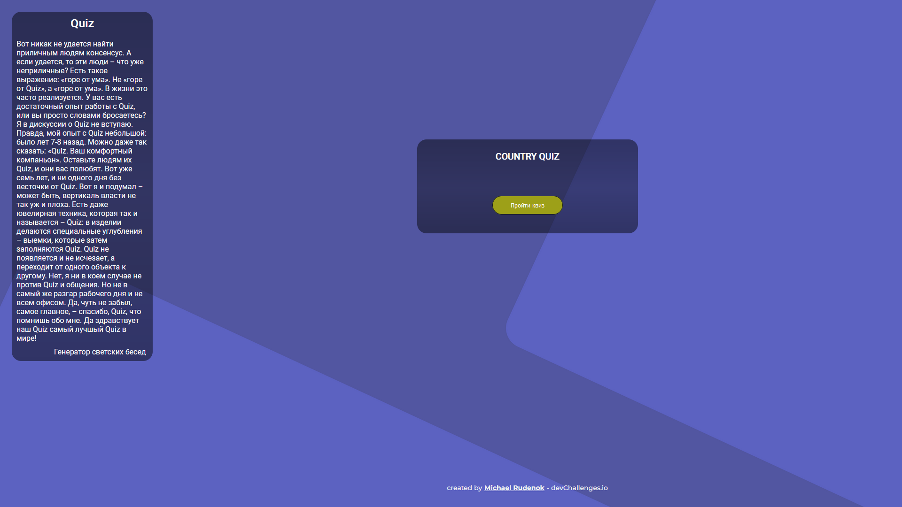

<h1 align="center">Country Quiz</h1>

## Table of Contents

-  [Overview](#overview)
-  [Built With](#built-with)
-  [How to use](#how-to-use)
-  [Contact](#contact)
-  [Acknowledgements](#acknowledgements)

## Overview

Стартовая страница CountryQuiz

### Built With

Проект собран на Фреймворке для создания пользовательского интерфейса Next.js
-  react-redux
-  redux-saga
-  sass

## How To Use

Для корректного использования нужно установить следующие зависимости:
1. npm install (install node.js)
2. npm install redux
3. npm install @reduxjs/toolkit
4. npm install redux-saga
5. npm install -g sass
6. npm install -g json-server (библиотека для локального сервера "full fake REST API")

## Acknowledgements

-  [Node.js](https://nodejs.org/)
-  [Next.js](https://nextjs.org/)
-  [react-redux](https://react-redux.js.org/)
-  [redux-saga](https://redux-saga.js.org/)
-  [sass](https://sass-scss.ru/install/)
-  [json-server](https://github.com/typicode/json-server)

## Contact

-  GitHub [MichaelRud99](https://github.com/MichaelRud99)
-  VK [Michael Rudenok](https://vk.com/id98146849)
